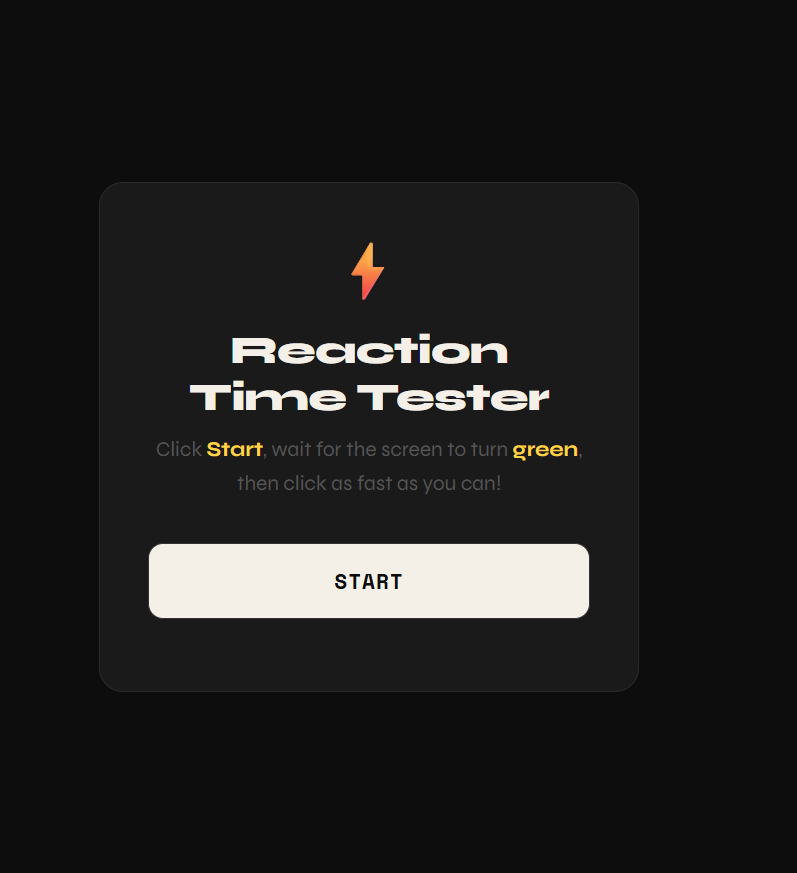
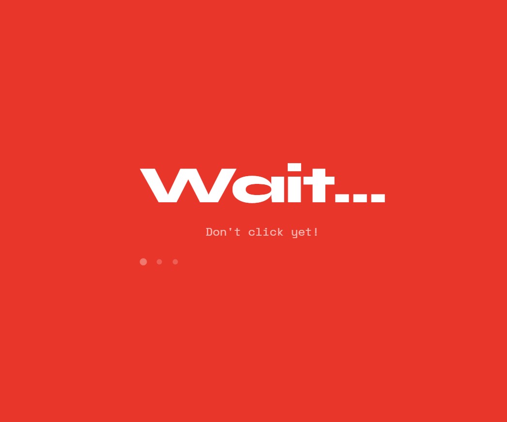
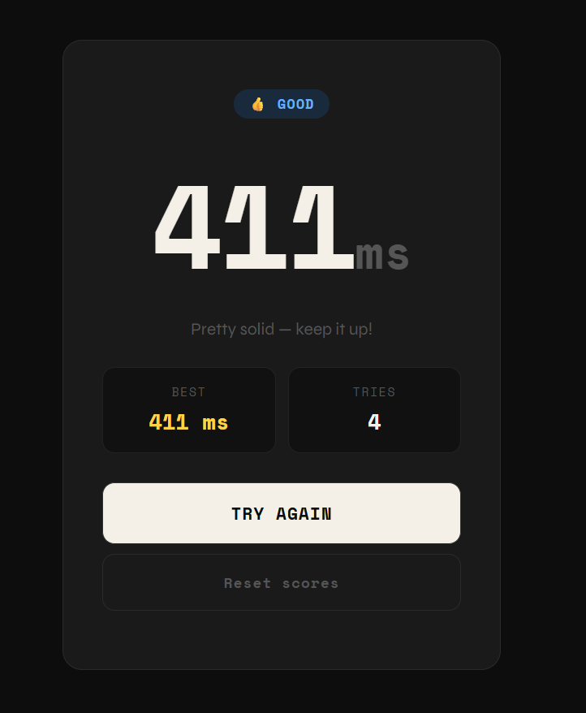

# Reaction Time Tester

An interactive web application that measures user reaction speed using HTML, CSS, and JavaScript.

## Features
- Random delay generation
- Reaction time measurement
- Best score tracking
- Early click detection
- Animated modern UI
- Reset functionality

## Technologies Used
- HTML
- CSS
- JavaScript

## Project Purpose
This project was created to practice front-end web development and JavaScript timing functions.

## Live Demo
https://laiba377.github.io/Reaction-Time-Tester/

## Screenshots

### Home Screen

### Wait Screen

### Click Screen

### Result Screen

## Author
Laiba Tul Jannat
